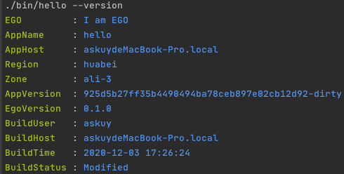

## EGO
[](https://github.com/gotomicro/ego/actions)
[](https://goreportcard.com/report/github.com/gotomicro/ego)
[](https://codecov.io/gh/gotomicro/ego)
[](https://goproxy.cn/stats/github.com/gotomicro/ego)
[](https://github.com/gotomicro/ego)
[](https://opensource.org/licenses/MIT)

## 帮助文档
[https://ego.gocn.vip](https://ego.gocn.vip)

## 介绍
EGO是一个集成里各种工程实践的框架。通过组件化的设计模式，保证了业务方能够统一的调用方式启动各种组件

使用EGO的优势
* 配置化驱动组件
* 屏蔽底层组件启动细节
* 微服务组件的可观测、可治理
* 可插拔的Ego-Component组件
* Fail Fast理念和错误友好提示

## 功能
* server HTTP
    * [例子](https://github.com/gotomicro/ego/tree/master/examples/server/http)
    * [使用方式](https://ego.gocn.vip/frame/server/http.html)
    * [错误日志](https://ego.gocn.vip/awesome/logger.html#_2-http%E6%9C%8D%E5%8A%A1%E7%AB%AF%E6%97%A5%E5%BF%97) 
* server gRPC
    * [例子](https://github.com/gotomicro/ego/tree/master/examples/server/grpc)
    * [使用方式](https://ego.gocn.vip/frame/server/grpc.html#example)
    * [错误日志](https://ego.gocn.vip/awesome/logger.html#_1-grpc%E6%9C%8D%E5%8A%A1%E7%AB%AF%E6%97%A5%E5%BF%97) 
* task job
    * [例子](https://github.com/gotomicro/ego/tree/master/examples/task/job)
    * [使用方式](https://ego.gocn.vip/frame/task/job.html)
* task cron
    * [例子](https://github.com/gotomicro/ego/tree/master/examples/task/cron)
    * [使用方式](https://ego.gocn.vip/frame/task/cron.html)
* client HTTP
    * [例子](https://github.com/gotomicro/ego/tree/master/examples/http/client)
    * [使用方式](https://ego.gocn.vip/frame/client/http.html#example)
    * [错误日志](https://ego.gocn.vip/awesome/logger.html#_4-http%E5%AE%A2%E6%88%B7%E7%AB%AF%E6%97%A5%E5%BF%97) 
* client gRPC
    * [直连例子](https://github.com/gotomicro/ego/tree/master/examples/grpc/direct)
    * [ETCD例子](https://github.com/gotomicro/ego-component/tree/master/eetcd/examples)
    * [使用方式](https://ego.gocn.vip/frame/client/grpc.html#example)
    * [错误日志](https://ego.gocn.vip/awesome/logger.html#_3-grpc%E5%AE%A2%E6%88%B7%E7%AB%AF%E6%97%A5%E5%BF%97) 
* client mysql
    * [例子](https://github.com/gotomicro/ego-component/tree/master/egorm/examples/gorm)
    * [使用方式](https://ego.gocn.vip/frame/client/gorm.html#example)
    * [错误日志](https://ego.gocn.vip/awesome/logger.html#_5-gorm%E5%AE%A2%E6%88%B7%E7%AB%AF%E6%97%A5%E5%BF%97) 
* client redis
    * [例子](https://github.com/gotomicro/ego-component/tree/master/eredis/examples/redis)
    * [使用方式](https://ego.gocn.vip/frame/client/redis.html#example)
    * [错误日志](https://ego.gocn.vip/awesome/logger.html#_6-redis%E5%AE%A2%E6%88%B7%E7%AB%AF%E6%97%A5%E5%BF%97) 
* client mongo
    * [例子](https://github.com/gotomicro/ego-component/tree/master/emongo)

## 特性介绍
* 配置驱动
所有组件启动方式为`组件名称.Load("配置名称").Build()`，可以创建一个组件实例。如以下`http server`，`egin`是组件名称，`server.http`是配置名称
```go
egin.Load("server.http").Build()
```
* 友好的debug
可以看到所有组件的请求参数和响应参数信息


* 链路
使用opentrace协议，自动将链路加入到日志里

* [统一的错误信息](https://ego.gocn.vip/awesome/logger.html)
* 统一的监控信息      

    
## Quick Start

### HelloWorld
```package main
import (
   "github.com/gin-gonic/gin"
   "github.com/gotomicro/ego"
   "github.com/gotomicro/ego/core/elog"
   "github.com/gotomicro/ego/server"
   "github.com/gotomicro/ego/server/egin"
)
//  export EGO_DEBUG=true && go run main.go --config=config.toml
func main() {
   if err := ego.New().Serve(func() *egin.Component {
      server := egin.Load("server.http").Build()
      server.GET("/hello", func(ctx *gin.Context) {
         ctx.JSON(200, "Hello EGO")
         return
      })
      return server
   }()).Run(); err != nil {
      elog.Panic("startup", elog.FieldErr(err))
   }
}
```

### 使用命令行运行
```
export EGO_DEBUG=true # 默认日志输出到logs目录，开启dev后日志输出到终端
go run main.go --config=config.toml
```

### 如下所示


这个时候我们可以发送一个指令，得到如下结果
```
➜  helloworld git:(master) ✗ curl http://127.0.0.1:9001/hello
"Hello Ego"%  
```

### 更加友好的包编译

使用scripts文件夹里的[包编译](examples/build)，可以看到优雅的version提示

